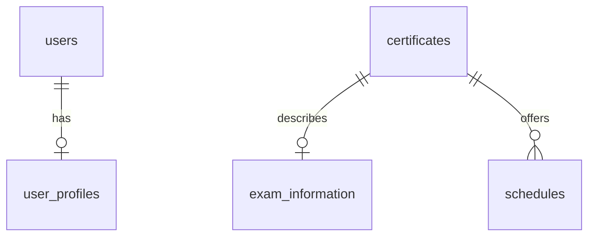
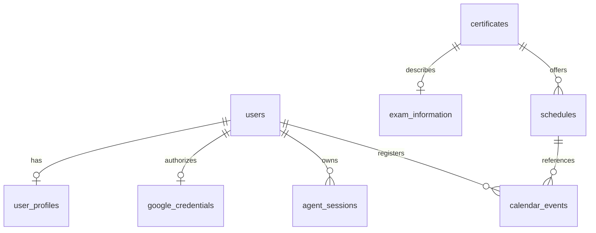

# Q-Net DB 설계 초안 v0.1

상태: 검토용 논리 설계와 구현 상태 기록. 아래 전체 초안이 모두 구현된 것은 아니다.

**2026-10-05 구현 반영:** Render PostgreSQL에 users, user_profiles, certificates, schedules, exam_information을 적용했다. 공식 종목 613개·상세정보 510종목, 시험일정 475종목·1,922단계까지 확대했다. 실제 접수기간 목록과 기술사 면접 단계를 지원한다. D05의 응시조건 JSONB와 reviewed 비교, D08은 계속 보류한다. D09는 미구현이며 북마크는 SQL/코드 주석 상태, 로드맵은 제외한다. 실행 코드는 [backend](../backend/README.md), 실제 상세정보 구조는 [설명 문서](EXAM_INFORMATION.md)를 기준으로 확인한다. 아래의 미확정 제안은 현재 구현 범위를 뜻하지 않는다.

기준: [PRD](../PRD.md), [API 초안](API_DRAFT.md), [공식 데이터 검증](../research/feasibility_summary.json).

## 현재 적용한 DB와 다음 단계

| 테이블 | 현재 적용 내용 | 상태 |
| --- | --- | --- |
| users | UUID, Google 제공자 사용자 ID, 선택 이메일, 생성·수정 시각 | 테이블 준비. 로그인 미연동 |
| user_profiles | 사용자별 학력·전공·선택 경력 날짜·보유 자격·희망 직무 등 | 저장·조회 함수와 검증 구현. HTTP API 미연결 |
| certificates | 공식 코드 UNIQUE, 종목명·분류·태그·설명·출처·조회 시각 | 공식 목록 613종목 저장 |
| exam_information | certificate_id PK/FK, subjects/pass_criteria/fees JSONB와 원문·조회 시각 | 기술자격 510종목 저장 |
| schedules | 종목·회차·단계별 UUID, 날짜 기간, registration_periods JSONB, 빈자리 접수·출처 | 475종목·1,922행 저장 |

실제 컬럼과 제약은 [기본 SQL](../backend/db/schema.sql), [시험 상세정보 SQL](../backend/db/exam_information.sql), [기존 일정 변경 SQL](../backend/db/schedule_periods.sql)을 기준으로 한다. 신규 DB 초기화와 기존 DB 마이그레이션은 별도 명령이다. 현재의 UNIQUE는 종목 공식 코드와 일정의 `(certificate_id, round_key, phase)` 등이며 보류한 Calendar 고유키를 적용한 것은 아니다.

전문자격 100종목은 certificates에만 수집했다. 다음 조사에서 확인한 상세정보·일정을 기존 구조에 수용할 수 있는지 먼저 테스트한다. 별도 테이블은 필요성을 확인한 뒤 결정한다. 이후 로그인 → 프로필 HTTP API → AI 기능 순서다. [전체 작업 현황](PROJECT_STATUS.md)을 함께 확인한다.

## D01. 설계 방향과 관계

PRD의 기본 테이블을 유지하면서 실제 공식 자료의 시험기간·시험 단계·출처를 보완한다. 아래는 현재 적용한 테이블 관계다.

아래 전체 관계도는 이전 검토안이다. Calendar 권한·이벤트 테이블은 보류, 대화 상태 저장은 미구현 제안이다. 북마크 SQL은 주석 상태이며 로드맵 테이블은 현재 범위에서 제외한다.

공식 출처 sources는 여러 정보 필드에서 참조한다. JSONB 안의 source_ids는 서비스에서 존재 여부를 검사한다. 이 초안은 최소 테이블 안이며 필드별 출처에 DB 외래키 강제가 필요하면 연결 테이블을 추가하는 대안을 검토한다.

공통: PK는 UUID, 시각은 timestamptz, 시험 날짜는 date, 금액은 원 단위 정수. 문자열 공식 코드는 선행 0을 보존한다. 아래 필수 표시는 NOT NULL을 의미하며, 외부 정보의 '미확인'은 null과 상태로 표현한다.

## D02. users — 로그인 사용자

| 컬럼 | 타입 | 필수 | 의미 |
| --- | --- | --- | --- |
| id | uuid PK | O | 내부 사용자 ID |
| provider | text | O | MVP google |
| provider_subject_id | text | O | 제공자의 고유 사용자 ID |
| email | text | - | 표시/연락용; 계정 식별의 기준은 아님 |
| created_at, updated_at | timestamptz | O | 생성/변경 시각 |

고유키: (provider, provider_subject_id). OAuth 토큰을 이 테이블이나 API 응답에 넣지 않는다. 서버 로그인 세션 저장 방식은 인증 구현 때 결정하며 Google 토큰과 별개다.

## D03. user_profiles — 추천과 응시조건 입력

| 컬럼 | 타입 | 필수 | 의미 |
| --- | --- | --- | --- |
| user_id | uuid PK/FK users | O | 사용자별 1건 |
| education_level | text | - | 고졸/전문학사/학사 등 합의할 코드 |
| education_status | text | - | 졸업/재학/졸업예정/기타 |
| graduation_date | date | - | 졸업 또는 예정 날짜 |
| major | text | - | 사용자 입력 전공 |
| major_status | text | - | provided / not_applicable / unknown |
| has_career | boolean | - | false=경력 없음, null=아직 답변 없음 |
| career_history | jsonb | O | 기본 []; 경력별 직무·기간·관련 분야 |
| qualifications | jsonb | O | 기본 []; 보유 자격 코드·취득일·확인 상태 |
| desired_job | text | - | 희망 직무 |
| current_status | text | - | 재직/구직/학생 등 |
| location | text | - | 지역; 주소 상세 입력은 요구하지 않음 |
| target_date | date | - | 희망 목표 시점 |
| created_at, updated_at | timestamptz | O | 시각 |

PRD 보완 제안: education_status, graduation_date, major_status, has_career, qualifications. 졸업 여부와 취득 후 경력에 따라 응시조건이 달라져 필요한 항목이다. 부족한 정보는 관련 판단 시에만 질문한다.

career_history 항목: job_title, field_code(확인 전 null), started_on, ended_on(null=재직 중), description. qualifications 항목: qnet_code, name, acquired_on, verification_status. 사용자 입력을 기관 확인 사실로 표시하지 않는다.

career_years는 별도 저장·확정 계산하지 않는다. 현재 경력 날짜는 선택 입력이며 기관 확인 정보와 사용자 자기 보고를 구분한다. 학습시간 필드와 로드맵 계산은 범위에서 제외한다.

검사: 입력한 경력 시작≤종료, 경력 없음과 경력 내역의 모순, 전공 상태와 전공명의 일관성. 부분 변경에서는 기존 값과 합친 상태를 검증한다. 전공 관련성·직무 인정 여부를 DB CHECK로 판정하지 않는다.

## D04. certificates — 공식 종목 목록

현재 컬럼은 id, qnet_code, name, category, career_tags, description, source_url, last_synced_at, updated_at이다. 아래 표의 series/직무/등급 코드, source_id, availability_status는 이전 제안이며 현재 DB에 추가하지 않았다. 코드 매핑과 현재 시행 여부를 추정해 채우지 않는다.

| 컬럼 | 타입 | 필수 | 의미 |
| --- | --- | --- | --- |
| id | uuid PK | O | 내부 ID |
| qnet_code | text UNIQUE | O | 공식 jmcd |
| name | text | O | 종목명 |
| category | text | O | 공식 qualgbcd |
| series_code, series_name | text | - | 공식 등급 분류 |
| job_major_code, job_middle_code | text | - | 공식 대/중직무 분류 |
| eligibility_grade_code | text | - | 검증한 grdCd 매핑; 추정 입력 금지 |
| career_tags | jsonb | O | 기본 []; 팀이 정의할 직무 연관 태그 |
| description | text | - | 출처가 있는 설명 |
| source_id | uuid FK sources | O | 목록 원본 |
| source_url | text | - | 사용자 확인용 공식 상세 링크 |
| availability_status | text | O | unknown / available / discontinued |
| last_synced_at, updated_at | timestamptz | O | 동기화/변경 시각 |

목록에 존재한다는 이유만으로 시행 중으로 단정하지 않는다. 시행 여부 상태 컬럼은 미구현이다. 등급 분류와 응시조건의 코드 체계를 혼용하지 않는다.

## D05. exam_information — 시험 상세정보와 보류한 응시조건

기술자격 513개 전체를 대상으로 상세정보 연동을 확대했다. 현재 저장된 시험정보는 510종목이며 464개는 세 정보 확보, 46개는 일부 미확인이다. 나머지 3개는 세 정보 모두 미확보다. 종목별 결과는 [확대 결과](DETAIL_EXPANSION_RESULTS.md), 실행 방법은 [일괄 수집 설명](BATCH_SYNC.md)에 기록했다.

현재 구현은 `certificate_id`를 PK/FK로 사용하고 `subjects`, `pass_criteria`, `fees`를 JSONB로 보관한다. 각 정보에 필기·실기·면접 값과 phases, 확인 상태, 공식 출처, 실제 조회 시각을 포함한다. 과목·기준은 단계 구분 없는 원문을 common으로 보관할 수 있다. 실기 단독은 phases=[practical]로 구분한다. 검토용 정제 원문은 raw_acquisition_text/raw_fee_text, 전체 조회·수정 시각은 retrieved_at/updated_at이다. 이번 변경은 JSONB 내부 필드 확장이므로 SQL 컬럼 변경은 없다. 이하 표의 eligibility_rules, 관련 학과, sources 연결 등은 아직 구현하지 않은 초안이다.

응시조건 JSONB 저장과 reviewed 경로 비교는 사용자 결정으로 보류한다. 과목·합격기준·응시료 JSONB는 이 기능과 별개의 확정된 시험정보 저장이다.

| 컬럼 | 타입 | 필수 | 의미 |
| --- | --- | --- | --- |
| id | uuid PK | O | 정보 ID |
| certificate_id | uuid UNIQUE/FK certificates | O | 종목별 현재 정보 1건 |
| subjects | jsonb | - | 단계별 과목 |
| pass_criteria | jsonb | - | 단계별 기준과 공식 원문 |
| exam_fee | jsonb | - | 단계별 amount, currency=KRW |
| related_majors | jsonb | - | 공식 관련 학과 안내 |
| eligibility_rules | jsonb | - | 아래의 검증 상태 포함 조건 경로 |
| field_sources | jsonb | O | 필드명 → source_ids 및 상태 |
| data_status | text | O | complete / partial / unavailable |
| source_url | text | - | 대표 공식 확인 링크 |
| retrieved_at, updated_at | timestamptz | O | 조회/저장 시각 |

eligibility_rules 항목은 path_id, official_text, conditions, interpretation_status, source_ids, rule_version, valid_from, valid_to로 구성한다. 경로 간 OR, 경로 내 조건은 AND. interpretation_status는 raw_only / reviewed / unsupported이며 raw_only 텍스트를 확정적인 자동 판정에 사용하지 않는다.

초기에는 확인한 종목만 reviewed 조건을 제공한다. 공식 등급 공통 조건은 수집 원본에 보존하고 종목별 적용을 확인한다. 동일 규칙을 여러 종목에서 본격 재사용할 때 eligibility_rules 독립 테이블로 분리한다. 지금은 미리 규칙 엔진/다수 연결 테이블을 만들지 않는다.

과목·수수료 등 필드별 출처와 조회 시각은 field_sources가 가리키는 sources에서 확인한다. 빈 배열과 자료 미확인을 구분한다. HTML은 정제된 텍스트로 다루며 외부 원문을 화면에 그대로 실행하지 않는다.

## D06. schedules — 회차의 시험 단계

현재 구현은 종목·회차·단계별 한 행이며 기술사는 `written`/`interview`, 다른 기술자격은 `written`/`practical`을 사용한다. 실기만 시행하는 회차도 지원한다. `source_url`, `last_synced_at`으로 일정 원문의 출처·시각을 보관한다. 아래 초안의 source_ids/data_status/validation_status는 DB 컬럼으로 구현하지 않았다.

`registration_periods` JSONB를 추가했다. 실제 접수기간을 `[{starts_on, ends_on, source_url, retrieved_at}]`로 저장하며 시작·종료 범위와 일치하는지, 서로 겹치지 않는지 검증한다. UI의 접수 가능 날짜는 이 목록을 사용한다. `registration_start/end`는 전체 범위이므로 그 사이의 모든 날짜가 접수 가능하다는 뜻이 아니다. 기존 스키마 변경은 `python -m backend.db.add_schedule_periods`로 적용한다. 기존 ID와 날짜는 유지한다.

PRD의 written_exam_date/practical_exam_date 단일 날짜 대신 **종목·회차·단계별 1행**을 제안한다. 실제 자료가 필기/실기 기간이며 전문자격은 1차/2차 형태도 있기 때문이다.

| 컬럼 | 타입 | 필수 | 의미 |
| --- | --- | --- | --- |
| id | uuid PK | O | 선택/Calendar 참조 ID |
| certificate_id | uuid FK certificates | O | 종목 |
| year | smallint | O | 시행 연도 |
| round_key | text | O | 제공자 계획을 정규화한 회차 키 |
| round_label | text | O | 공식 시행계획명 |
| phase | text | O | written / practical / interview / first / second / other |
| registration_start, registration_end | date | - | 접수기간의 전체 범위, 양 끝 포함 |
| registration_periods | jsonb 배열 | O | 실제 접수기간·각 기간의 출처와 조회 시각. 미확인 시 [] |
| exam_start, exam_end | date | - | 시험기간, 양 끝 포함 |
| result_date | date | - | 발표/조회 시작일 |
| result_display_end | date | - | 결과 조회 종료일 |
| vacancy_registration_start/end | date | - | 빈자리 접수기간 |
| exam_site | text | - | 실제 확인 가능한 장소; 개인 배정 장소로 오인 금지 |
| source_ids | jsonb | O | 확인 근거 목록 |
| data_status | text | O | complete / partial / unavailable |
| validation_status | text | O | valid / incomplete / invalid / conflicting |
| last_synced_at, updated_at | timestamptz | O | 시각 |

고유키: (certificate_id, round_key, phase). round_key는 단순 연도+회차 숫자만으로 만들지 않는다. 같은 숫자 회차여도 시행계획/대상 조건이 다른 자료는 별도 키다. 제공자 계획명 변경 시 기존 행과의 대응을 확인하여 중복 회차 생성을 막는다.

검사: 각 기간의 시작≤종료, 발표일과 시험 종료일의 일관성. 서로 다른 단계 간 날짜 비교는 서비스에서 검사한다. 모순 데이터는 사용자 등록 대상으로 제공하지 않는다. 개인 시험일, 잔여 좌석, 상시시험 날짜는 근거 없이 채우지 않는다.

사용자 선택은 프론트 요청 또는 agent_sessions에 보관한다. 별도 선택 테이블은 이 초안에서 추가하지 않는다. D-Day와 접수 상태는 조회 시 계산한다.

## D07. sources / api_sync_logs — 근거와 동기화 기록

미구현 제안이다. 현재는 종목·일정의 source_url/last_synced_at, 상세정보 JSON과 접수기간 목록의 source_url/retrieved_at을 직접 보관한다. 수집·검증 기록은 research의 JSON 파일로 남긴다.

sources는 원본 조회 건마다 보존하며 과거 근거를 덮어쓰지 않는다.

| sources 컬럼 | 타입 | 의미 |
| --- | --- | --- |
| id | uuid PK | 출처 ID |
| source_type | text NOT NULL | api / official_page / official_document |
| source_url | text NOT NULL | 공식 출처 주소; 인증 키 제거 |
| request_params | jsonb NOT NULL | 기본 {}; 비밀정보 제외 조회 조건 |
| retrieved_at | timestamptz NOT NULL | 실제 원본 조회 시각 |
| data_version | text nullable | 제공자 버전/적용 기간 등 확인된 값 |
| content_hash | text nullable | 원본 변경 확인용 |
| raw_content_ref | text nullable | 제한된 원본 파일/저장소 위치 |

DB 캐시와 RAG는 조회 방식이지 원본 기관의 종류가 아니다. 캐시를 읽은 시각을 공식 자료의 조회 시각으로 바꾸지 않는다. 공식 문서의 다운로드·내용 확인 전에는 RAG 검증 완료로 표시하지 않는다.

| api_sync_logs 컬럼 | 타입 | 의미 |
| --- | --- | --- |
| id | uuid PK | 기록 ID |
| tool_name | text NOT NULL | 호출 도구/작업 |
| request_params | jsonb NOT NULL | 비밀정보 제외 |
| success | boolean NOT NULL | HTTP 및 제공자 결과코드까지 판단 |
| error_type | text nullable | timeout / auth_required / provider_error / parse_error / validation_error |
| provider_result_code | text nullable | HTTP 200 안의 업무 오류도 기록 |
| response_time_ms | integer nullable | 응답시간 |
| retry_count | smallint NOT NULL | 0 또는 1 |
| source_id | uuid nullable FK sources | 저장 원본 연결 |
| created_at | timestamptz NOT NULL | 시각 |

빈 정상 결과는 success=true이며 '일정 없음'과 '호출 실패'를 구분한다. 요청 전문에 사용자 프로필이나 Google 토큰을 기록하지 않는다.

## D08. calendar_events / google_credentials — 일정 등록

현재 보류 상태다. 아래의 primary 제한·고유키·권한 저장 테이블은 이전 검토안이며 DB에 적용하지 않았다.

| calendar_events 컬럼 | 타입 | 의미 |
| --- | --- | --- |
| id | uuid PK | 내부 이벤트 ID |
| user_id | uuid NOT NULL FK users | 사용자 |
| schedule_id | uuid NOT NULL FK schedules | 시험 단계 |
| event_type | text NOT NULL | registration / exam / result |
| calendar_id | text NOT NULL | MVP primary |
| google_event_id | text nullable | 제공자 식별자; API가 반환한 값 저장 |
| starts_on, ends_on | date NOT NULL | 종일 일정, 양 끝 포함 |
| source_ids | jsonb NOT NULL | 등록 당시 근거 |
| sync_status | text NOT NULL | pending / synced / failed / unknown |
| error_code | text nullable | 실패/불명확 사유 |
| created_at, updated_at | timestamptz NOT NULL | 시각 |

고유키: (user_id, schedule_id, event_type). certificate_id는 schedule_id를 통해 얻으므로 중복 저장하지 않는다. 이 키는 PRD의 사용자+종목+일정+종류 중복 방지 목적을 충족한다. 여러 캘린더에 각각 등록하는 기능을 추가하면 고유키 정책을 재검토한다.

DB에서 pending 행을 먼저 확보한 요청만 외부 생성한다. 외부 성공 후 저장 실패는 unknown으로 복구/조회하며 무조건 재생성하지 않는다. 안정적인 제공자 식별자 및 조회 복구 방법은 Google 실제 연동 테스트로 확정한다. 일정이 나중에 바뀌어도 기존 등록 당시 날짜와 출처는 보존한다. 자동 수정은 별도 요구사항이다.

| google_credentials 컬럼 | 타입 | 의미 |
| --- | --- | --- |
| user_id | uuid PK/FK users | 사용자별 Google 연결 |
| access_token_encrypted | text nullable | 암호화된 접근 토큰 |
| refresh_token_encrypted | text nullable | 암호화된 갱신 토큰 |
| granted_scopes | jsonb NOT NULL | 실제 동의한 권한 |
| expires_at | timestamptz nullable | 토큰 만료 시각 |
| connection_status | text NOT NULL | connected / reauth_required / revoked |
| updated_at | timestamptz NOT NULL | 시각 |

추가 테이블 제안 이유: 로그인만으로 Calendar 권한을 가정할 수 없으며 서버에서 등록할 때 권한 정보가 필요하다. 암호화 키는 DB 밖에서 관리하고 API 응답에서 토큰을 제외한다.

## D09. agent_sessions — 대화 진행 상태

추가 제안: 대화 기능을 MVP에 포함할 때만 필요하다. LangGraph의 실제 체크포인트 저장 방식을 채택하면 중복 상태 테이블을 만들지 않고 해당 저장소에 대응한다.

| 컬럼 | 타입 | 의미 |
| --- | --- | --- |
| id | uuid PK | 대화 세션 |
| user_id | uuid NOT NULL FK users | 소유자 |
| state | jsonb NOT NULL | 선택 종목/회차, 질문, 도구 결과 요약, 검증 오류, retry_count |
| version | integer NOT NULL | 동시 메시지 처리 충돌 감지 |
| created_at, updated_at | timestamptz NOT NULL | 시각 |

프로필 원본과 공식 데이터 전체를 State에 복사하지 않고 ID와 버전을 참조한다. 사용자에게 보이는 대화 내역 저장 범위/보관 기간은 구현 전 결정한다. 비공개 추론·비밀키·토큰은 저장하지 않는다.

## D10. 선택 테이블과 운영 규칙

북마크 포함 시 bookmarks(id, user_id FK, certificate_id FK, created_at), UNIQUE(user_id, certificate_id).

로드맵은 현재 작업 범위에서 제외한다. 관련 테이블·학습시간 필드·API를 만들지 않는다. 향후 사용자가 다시 결정한다.

우선 인덱스: schedules(certificate_id, year), calendar_events(user_id, created_at), agent_sessions(user_id, updated_at), api_sync_logs(created_at). PK/UNIQUE 인덱스와 중복하지 않는다. 전문 검색·벡터 저장소는 실제 공식 문서 RAG 검증 후 결정한다.

공식 종목/일정은 Calendar 참조가 있으면 물리 삭제하지 않는다. 사용자 탈퇴는 프로필·토큰·대화·등록 메타데이터 삭제 정책을 적용하며 Google의 기존 이벤트 삭제 여부는 별도 동의 정책으로 결정한다. API 로그와 원본 보관 기간은 팀 운영 결정사항이다.

## D11. 검토할 결정

1. D03: 보유 자격·경력 날짜 선택 입력은 확정·구현. 인증 후 HTTP 연결이 남았다.
2. D05: 응시조건 저장·reviewed 비교는 보류. 시험 상세정보는 별도로 구현 완료.
3. D06: 종목·회차·필기/실기/면접별 행과 기간 저장은 확정·구현. 전문자격 매핑은 다음 조사 대상.
4. D07: 현재 직접 출처·조회 시각 보관. 독립 sources 테이블과 연결 구조는 미구현 제안.
5. D08: Calendar primary 제한과 중복 키는 보류.
6. D09: AI 기능 단계에서 대화 저장소 검토. LangGraph 체크포인트와 이중 저장하지 않는 원칙.
7. 북마크는 향후 포함·현재 전체 주석 상태. 로드맵은 현재 범위 제외·향후 결정.

현재 작업 순서: 전문자격 공식 상세정보·일정 조사 및 확대 → Google 로그인 → 프로필 HTTP API → AI 기능. 보류 항목은 사용자 결정 후 재개한다.
