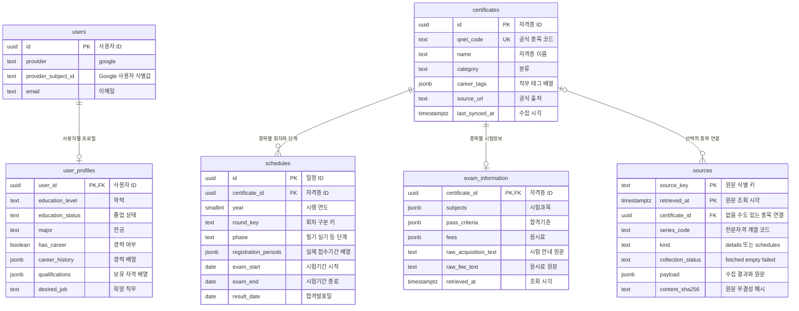

# Q-Net 팀 공유 문서

기준일: 2026-10-07. 실행 방법·진행 현황·API·협업 규칙·DB·데이터 증빙을 이 문서에서 관리한다. 제품 요구사항은 [PRD](../PRD.md), 구현 규칙은 [AGENTS](../AGENTS.md)를 따른다. 아래의 미구현 항목은 구현 완료를 의미하지 않는다.

목차: [현재 상태](#현재-상태) · [실행과 테스트](#실행과-테스트) · [API](#api) · [협업과 함수명](#협업과-함수명) · [DB](#db) · [데이터 수집과 검증](#데이터-수집과-검증) · [예외처리 증빙](#예외처리-증빙) · [다음 작업](#다음-작업)

## 현재 상태

| 영역 | 상태 | 확인된 범위 |
| --- | --- | --- |
| FastAPI | 조회 API 구현 | 서버 상태·DB 상태·자격증 검색·상세·일정, Swagger 제공 |
| Render PostgreSQL | 연결·저장 완료 | 종목 613개, 기술자격 상세 510개, 일정 1,922행 |
| 기술자격 상세 | 일부 보완 필요 | 513종목 중 전체 정보 464, 일부 정보 46, 미확보 3 |
| 기술자격 일정 | 일부 보완 필요 | 475종목 저장, 미연동 38종목 |
| 전문자격 | 수집 원문 DB 보관 완료 | 상세 100종목·일정 37계열의 수집 기록. 상세 정규화·종목별 일정 연결은 미구현 |
| 사용자 프로필 | DB 모델·저장 함수 준비 | 인증 사용자와 HTTP API 연결은 미구현 |
| Google 로그인 / Calendar | 미구현·담당 분리 | 로그인 1명, Calendar 1명이 각각 구현 예정 |
| Agent / RAG / LangSmith | 미구현 | 선택형 화면 + 백엔드 Agent를 중심으로 회의에서 범위 확정 |
| 서버 배포·프론트 연결 | 남은 작업 | Render DB 연결과 FastAPI 서버 배포는 별개 |
| 북마크 / 로드맵 | 비활성 / 제외 | 북마크 SQL·코드는 주석 유지, 로드맵은 구현 범위 제외 |

응시조건 비교·Calendar는 기존 코드에서 보류된 상태다. 담당자가 구현하기 전에 재개 범위·인증·DB 계약을 합의한다. 희망 직무를 선택 사항으로 두고 검토된 기술자격 3~5개부터 조건 비교하는 방안은 회의 결정 대상이다.

## 실행과 테스트

실제 작업 루트는 `C:\study\Q-Net-Backend-dev`다. 같은 이름의 하위 폴더는 별도 Git 사본이므로 이번 작업에 포함하지 않는다. 아래 명령은 루트에서 실행한다.

```powershell
python -m venv .venv
.\.venv\Scripts\python.exe -m pip install -r backend/requirements.txt
if (-not (Test-Path backend/.env)) { Copy-Item backend/.env.example backend/.env }
# backend/.env에 Render DATABASE_URL을 직접 입력한다. 기존 파일은 덮어쓰지 않는다.
.\.venv\Scripts\python.exe -m uvicorn backend.main:app --host 127.0.0.1 --port 8000
```

로컬에서는 Render External Database URL과 SSL 설정을 사용한다. 코드가 읽는 파일은 `backend/.env`이며 같은 이름의 환경변수가 있으면 환경변수가 우선한다. `.env`·토큰·DB URL은 커밋하지 않는다. 설정·코드를 갱신하면 서버를 재시작한다.

[Swagger](http://127.0.0.1:8000/docs)에서 검색 결과의 UUID를 얻어 상세·일정을 조회한다. 일정에는 `year=2026`이 필요하다. ReDoc은 현재 비활성이다.

```powershell
.\.venv\Scripts\python.exe -m backend.db.check
.\.venv\Scripts\python.exe -m unittest discover -s backend/tests
.\.venv\Scripts\python.exe -m unittest research.test_preparation research.test_apply_preparation
```

최근 확인: 백엔드 82개 중 79개 통과·전용 테스트 DB가 필요한 3개 생략, 데이터 준비 테스트 9개 통과. `TEST_DATABASE_URL`은 별도 테스트 DB에만 설정한다. 앱 실행·Git push만으로 DB 초기화나 데이터 갱신은 실행되지 않는다.

## API

### 구현된 조회 경로

경로에서 `/api`·`/v1`을 제거했다. 아래 경로로 통일하며 이전 접두어 경로는 제공하지 않는다.

| 메서드 | 경로 | 내용 |
| --- | --- | --- |
| GET | `/health` | 실행 상태와 DB 설정 여부 |
| GET | `/health/database` | 실제 DB 접속과 필수 테이블 확인 |
| GET | `/certificates` | q / category / limit / offset으로 종목 검색 |
| GET | `/certificates/{certificate_id}` | 기본정보와 과목·합격기준·응시료 |
| GET | `/certificates/{certificate_id}/schedules?year=2026` | 선택 종목·연도의 회차·단계별 일정 |

`certificate_id`는 내부 UUID, `qnet_code`는 앞자리 0을 보존하는 공식 코드 문자열이다. 검색의 limit 기본값은 20·최대 100이다. category는 기술 T / 전문 S다. 목록에 있다는 사실만으로 현재 시행 여부나 개인 응시 가능 여부를 확정하지 않는다.

상세정보는 `exam_information.subjects / pass_criteria / fees`를 반환한다. 각 항목에 값·status·source_url·retrieved_at·phases가 있으며 written / practical / interview를 구분한다. 단계 구분 없는 과목·기준은 common, 미확인은 null, 금액은 KRW다. `data_status`는 complete / partial / unavailable이다. 상세 미수집은 200과 확인 필요 안내, 없는 UUID는 404, 잘못된 입력은 422, DB 조회 불가는 503이다. 현재 실제 오류 응답은 FastAPI의 detail 형식이며 공통 오류 객체는 향후 합의한다.

일정은 날짜 기간을 반환하고 실제 접수 가능 날짜는 `registration_periods`를 사용한다. 빈 목록은 수집된 일정이 없다는 뜻이며 시험 미시행을 의미하지 않는다. 개인 배정 시험일·시험장은 별도 확인한다. D-Day·접수 상태 계산은 향후 구현하며 현재 DB에 고정 저장하지 않는다.

### 앞으로 구현할 경로와 담당

아래 14개 API는 아직 호출할 수 없다. 담당자는 요청·응답·인증 방식을 합의한 뒤 구현한다.

| 기능 | 메서드 | 경로 | 담당 |
| --- | --- | --- | --- |
| Google 로그인·회원가입 | POST | `/auth/google` | 로그인 담당 |
| 현재 로그인 사용자 | GET | `/auth/me` | 로그인 담당 |
| 로그아웃 | POST | `/auth/logout` | 로그인 담당 |
| 프로필 조회 | GET | `/me/profile` | 별도 확정 |
| 프로필 저장·수정 | PATCH | `/me/profile` | 별도 확정 |
| 응시요건 확인 | POST | `/certificates/{certificate_id}/eligibility` | 별도 확정 |
| Agent 실행·추가 답변 | POST | `/agent/run` | 별도 확정 |
| Agent 작업 상태 | GET | `/agent/tasks/{task_id}` | 별도 확정 |
| 공식 문서 정보 보완 | POST | `/certificates/{certificate_id}/supplement` | 별도 확정 |
| Calendar 권한 연결 시작 | GET | `/calendar/connect` | Calendar 담당 |
| Calendar 권한 연결 완료 | GET | `/calendar/callback` | Calendar 담당 |
| Calendar 미리보기 | POST | `/calendar/preview` | Calendar 담당 |
| Calendar 실제 등록 | POST | `/calendar/register` | Calendar 담당 |
| Calendar 등록 내역 | GET | `/calendar/events` | Calendar 담당 |

### 연결 계약

- **로그인:** Google ID 토큰을 검증해 회원을 생성·조회하고 서비스 로그인을 발급한다. Cookie / Bearer, 만료·로그아웃·CORS 규칙은 두 담당자가 함께 확정한다. 서버가 확인한 사용자 ID만 사용한다.
- **프로필:** PATCH의 생략 필드는 유지, 일반 필드 null은 삭제, 경력·보유 자격 배열 null은 []로 초기화한다. 자격 취득일·경력 날짜는 필요할 때 추가 입력받는다.
- **응시요건:** 검토한 공식 규칙을 Python으로 비교한다. 결과는 eligible / needs_more_info / possibly_ineligible / unknown이며 법적 자격 확정이 아닌 사전 안내다.
- **Agent·RAG:** 작업 ID·종목·요청·추가 답변을 받고 상태·추가 질문·결과·출처를 반환한다. RAG는 선택한 항목의 공식 근거를 검색하고 없으면 확인 필요로 안내한다. 작업 조회는 사용자 소유권을 확인한다.
- **Calendar:** 로그인과 권한 동의는 별개다. callback의 code·state를 검증하고 토큰 저장·갱신·권한 거절 처리를 합의한다. schedule_ids·event_types로 미리보기를 만들고 사용자 확인 후 등록한다. 미리보기는 외부 이벤트를 생성하지 않는다.
- **등록 결과:** created / already_exists / excluded / failed / unknown을 항목별로 제공하는 방안이다. 과거 일정·중복·부분 실패를 구분한다. 결과가 불명확한 외부 생성은 무조건 재시도하지 않는다. 대상 캘린더·종일 기간의 종료일 변환·중복 키·DB 저장 실패 복구를 합의한다.

AI는 도구 선택·추가 질문·근거 설명·잘못된 도구 인자 수정 제안을 맡는다. 조건 비교·날짜 계산·권한 확인·실제 등록은 Python이 맡는다. LangGraph는 검증·추가 질문·제한된 재시도·대체 경로를 관리하고, LangSmith는 실행을 기록·평가하는 역할로 계획한다. 현재 수집기의 예외처리만으로 Agent·RAG·LangSmith 구현 완료를 주장하지 않는다.

## 협업과 함수명

최신 dev에서 기능 브랜치를 만들고 PR로 dev에 합친다. 병합 전 최신 dev와 충돌·테스트를 확인하고, 검증된 배포 버전을 main에 반영한다.

| 담당 영역 | 파일 분리 방향 | 공동 합의 |
| --- | --- | --- |
| 로그인 | backend/routers/auth.py와 인증 처리 파일 | 공통 사용자 식별 함수·세션 |
| Calendar | backend/routers/calendar.py와 Calendar 처리 파일 | 로그인 담당자의 인증 함수를 재사용 |
| 프로필·Agent·RAG | 기능별 Router와 처리 파일 | 입력·출력·상태·권한 |
| 공용 파일 | main.py / requirements.txt / .env.example | Router 연결은 한 사람이 취합, 패키지·변수 이름 공유 |
| DB | 기능별 SQL 파일 | 공유 Render DB는 브랜치로 분리되지 않으므로 적용 순서 취합 |

위 Router 분리는 앞으로의 구현 방식이다. 현재 조회 코드는 [main.py](../backend/main.py), 처리 로직은 [services.py](../backend/services.py)에 있다. 같은 파일의 같은 부분 수정은 충돌하기 쉬우며, Git 충돌이 없어도 API·DB 계약이 다르면 연동 오류가 생길 수 있다.

함수명은 **영어 소문자·밑줄, 동작 + 대상**이다. 생성 create_, 한 개 조회 get_, 목록 list_, 수정 update_, 삭제 delete_, 검색 search_, 외부 조회 fetch_, 검사 validate_를 사용한다. 조건은 get_certificate_by_code처럼 뒤에 붙인다.

| 변경 파일 | 현재 이름 ← 이전 이름 |
| --- | --- |
| main.py | get_health ← health, get_database_health ← database_health |
| main.py | list_certificates ← certificates, get_certificate_detail ← detail, list_schedules ← schedules |
| services.py / db/repository.py | get_certificate_detail ← certificate_detail / list_schedules ← get_schedules |
| exam_data.py | extract_plain_text ← plain_text, parse_subjects ← subject_list, extract_section ← find_section |
| sync_schedule_pages.py / apply_schedule_pages.py | collect_schedule_pages ← collect / reprocess_schedule_pages ← reprocess |

12개 함수와 호출·import·mock 대상을 함께 변경했다. **save_*·main·__init__·라이브러리 콜백·Boolean 함수는 유지한다.** 생성·갱신 함수는 upsert_*로 바꾸거나 분리하지 않았다. API와 서비스가 같은 이름이면 services.get_certificate_detail처럼 모듈을 붙인다. HTTP 경로는 유지했지만 함수명 기반 OpenAPI operationId는 달라지므로 생성형 SDK를 사용한다면 갱신한다.

## DB

Render PostgreSQL의 실제 적용 구조는 SQL을 기준으로 한다.

### 현재 DB 관계도 (ERD)

현재 SQL에 정의된 6개 테이블의 핵심 컬럼과 실제 외래키 관계다. 가독성을 위해 일부 날짜·관리 컬럼은 생략했으며 전체 정의는 아래 SQL 링크를 참고한다. `PK`는 기본키, `FK`는 외래키, `UK`는 단일 컬럼 고유키다.



- 사용자 1명은 프로필을 최대 1개 가진다. 자격증 1개에는 여러 일정과 최대 1개의 시험 상세정보가 연결된다.
- `sources.certificate_id`는 선택 값이다. 종목과 아직 연결하지 못한 전문자격 계열 원문도 독립적으로 보관한다.
- 복합 고유 조건: `users(provider, provider_subject_id)`, `schedules(certificate_id, round_key, phase)`. `sources(source_key, retrieved_at)`는 두 컬럼을 함께 사용하는 복합 기본키다.
- JSONB의 경력·보유 자격·접수기간은 현재 별도 테이블이 아닌 배열이다. 사용자와 자격증 사이에 직접 연결된 외래키는 없다.
- 관심 분야·NCS 연결, Calendar 이벤트, Agent 상태는 이 ERD에 포함되지 않는다. 해당 테이블은 아직 구현되지 않았다.

| 테이블 | 핵심 내용·중복 기준 | 구현 근거 |
| --- | --- | --- |
| users | Google 사용자, UUID, provider + provider_subject_id 고유 | [기본 SQL](../backend/db/schema.sql) |
| user_profiles | user_id 연결, 학력·졸업 상태·전공·경력·보유 자격·희망 직무 등 | [프로필 입력 모델](../backend/schemas.py) |
| certificates | 공식 코드·이름·분류·태그·출처·조회 시각, qnet_code 고유 | [기본 SQL](../backend/db/schema.sql) |
| schedules | 종목·회차·단계·날짜 기간, certificate_id + round_key + phase 고유 | [기본 SQL](../backend/db/schema.sql), [기간 보완 SQL](../backend/db/schedule_periods.sql) |
| exam_information | 종목별 과목·기준·응시료 JSONB와 원문·조회 시각 | [시험정보 SQL](../backend/db/exam_information.sql) |
| sources | 전문 수집 결과·전체 원문·해시·상태·일정 후보, source_key + retrieved_at 고유 | [원문 SQL](../backend/db/sources.sql) |

sources는 원문 보관용이며 현재 상세·일정 API가 자동으로 조회하는 테이블이 아니다. Calendar 이벤트·Google 권한·Agent 상태·응시조건 규칙은 미구현이며 실제 기능에 필요한 구조만 합의 후 추가한다. 북마크는 주석 상태다.

DB 저장은 기존 종목·일정 ID와 확인한 정보를 보존하고 오래된 원본으로 최신 정보를 덮어쓰지 않는다. 접수 시작 ≤ 종료 ≤ 시험 시작, 시험 시작 ≤ 종료 ≤ 발표, 발표 ≤ 표시 종료 등은 모델과 DB에서 검사한다. 출처와 조회 시각은 실제 원본 기준으로 남긴다.

기존 공유 DB에는 초기화 명령을 다시 실행하지 않는다. 새로운 빈 DB를 준비할 때만 `python -m backend.db.initialize`를 사용한다. 기존 DB의 스키마 변경은 담당자가 SQL·적용 결과를 확인해 취합한다.

## 데이터 수집과 검증

### 실제 저장과 남은 보완

전문자격 원문 137건과 기존 DB와 다른 기술자격 일정 후보 15건을 sources에 총 152건 저장했다. 별도 연결에서 원문·해시 152건 일치를 확인했고 재실행 신규 저장은 0건이었다. 기존 조회 테이블은 유지했다.

15건은 건축기사·전기기사·전기산업기사·정보처리기사·정보처리산업기사의 실기 1~3회차다. 기존 API와 공식 페이지가 제공하는 발표 표시 종료일·빈자리 접수일·출처가 달라 후보로 별도 보관했다. 전문 계열별 일정도 모든 등급에 임의 복제하지 않는다.

준비 자료: 전문 상세 정상 56 / 빈 응답 36 / 실패 8, 일정 37계열 중 정상 35 / 실패 2, 날짜 검증을 통과한 전문 일정 후보 72행, 문서 원문 1,574개, 원본 확인 목록 719파일. 문서 원문 확보는 RAG 검색·청킹·임베딩 완료를 뜻하지 않는다.

기술 일정 미연동 38종목은 상시검정 12 / 정기 표에 일정 없음 9 / 종목명 대조 실패 17로 구분한다. 빈 정보는 폐지·미시행으로 단정하지 않는다. 개인 시험장 배정이나 지역별 상시 세부 일정은 이번 수집 범위 밖이다.

### 실행 명령

기본은 수집·검증·미리보기이며 **--apply가 실제 저장**이다. 저장 전 출력과 원본 시각을 확인한다. --help에서 상세 옵션을 확인한다.

```powershell
# 준비 파일 재생성: API·DB 호출 없음
.\.venv\Scripts\python.exe -m research.prepare_data
# 전문자격 원문 저장: 기본은 검증만, --apply는 DB 저장
.\.venv\Scripts\python.exe -m research.apply_preparation
.\.venv\Scripts\python.exe -m research.apply_preparation --apply
# 지정 종목 상세·일정 수집: 기본은 저장 없음
.\.venv\Scripts\python.exe -m backend.sync_batch --codes 1320 1150
# 공식 페이지 일정 수집과 보관 원본 재검증: 저장 없음
.\.venv\Scripts\python.exe -m backend.sync_schedule_pages
.\.venv\Scripts\python.exe -m backend.apply_schedule_pages
# 수집 상세 원본 재처리: 저장 없음
.\.venv\Scripts\python.exe -m backend.sync_batch --from-report research/all_technical_detail_sources.json --allow-partial
```

기술 상세 전체 수집은 backend.sync_batch의 --all-technical --only details, 중단 이어받기는 --resume을 사용한다. 전문 수집은 research.collect_preparation --help를 참고한다. 요청별 최대 1회 재시도, 실패와 빈 응답 분리, 종목별 처리 지속을 유지한다. 빈 응답에 동일 요청을 반복하지 않는다.

시험 상세 변환은 extract_plain_text → extract_section → split_phases / parse_subjects / parse_fees → Pydantic 검증 → save_exam_information 순서다. 단계·금액을 추정하지 않으며 --allow-partial에서도 기존 확인 값을 지우지 않는다. 공식 페이지 일정과 시행공고의 다중 접수기간을 대조하고, 기간별 출처를 보관한다. 연도가 바뀌면 새 공고를 검토한다.

### 원본·증빙 찾기

| 자료 | 파일 |
| --- | --- |
| 종목별 누락과 남은 작업 | [coverage.csv](../research/preparation/coverage.csv), [work_queue.json](../research/preparation/work_queue.json) |
| 전문 수집 결과·섹션·종목명 | [professional_sources.json](../research/preparation/professional_sources.json), [professional_inventory.json](../research/preparation/professional_inventory.json) |
| 전문 일정 후보·제외 사유 | [후보 일정](../research/preparation/professional_series_schedules.json), [일정 오류](../research/preparation/professional_schedule_issues.json) |
| 기술 상세·일정 저장 결과 | [상세 저장](../research/all_technical_detail_applied.json), [일정 저장](../research/all_technical_schedule_applied.json) |
| 기술 상세·일정 전체 검증 | [상세 검증](../research/all_technical_detail_verification.json), [일정 검증](../research/all_technical_schedule_verification.json) |
| 문서 원문·원본 해시 | [official_documents.jsonl](../research/preparation/official_documents.jsonl), [source_manifest.json](../research/preparation/source_manifest.json) |
| 신규 DB 보관·중복 검증 | [DB 저장](../research/preparation/DB_원문반영_결과.json), [재실행](../research/preparation/DB_재실행_검증.json) |
| 경로·함수명 변경 실제 조회 | [경로 검증](../research/api_routes_verification.json), [함수명 검증](../research/function_names_verification.json) |

과거 검증 파일의 경로·시각은 당시 실행 기록이며 덮어쓰지 않는다. Git 속성으로 공식 원문의 바이트와 해시를 보존한다. Windows 수집기의 LF→CRLF 변환은 줄바꿈만 복원해 응답 해시와 대조한다.

## 예외처리 증빙

전문 상세 100종목 중 빈 응답 36종목은 HTTP 200·resultCode 00·items 0이었다. 실패 8종목 중 5종목은 두 번 모두 resultCode 99, 청소년상담사 1급은 첫 99 후 시간초과, 2·3급은 두 번 모두 시간초과였다. 99 메시지는 `Failed to validate a newly established connection.`이며 요청 제한 시간은 20초다.

5종목: 기계경비지도사, 이탈리아어 관광통역안내사, 호텔경영사, 국가유산수리기술자(조경), 정수시설운영관리사 2급. 빈 응답 전체 36종목과 실패 8종목·원래 호출 60회는 [예외 목록 CSV](../research/preparation/professional_exception_cases.csv)에서 확인한다.

유형별 2종목만 재조사한 결과이며 다른 종목 전체의 원인으로 일반화하지 않는다.

| 유형·표본 | 재조사 결과 | 판단 범위 |
| --- | --- | --- |
| 빈 응답: 국가유산수리기술자(보수) | API items 0, 공식 상세 탭에는 시험방법·응시료 | API·웹의 제공 자료 차이 확인. 내부 누락 원인은 미확정 |
| 빈 응답: 경매사(청과) | API items 0, 상세 탭은 시험정보 없음, 별도 공식 FAQ에는 안내 | 공식 정보가 다른 페이지에 분산됨. 상세 API 누락 이유는 미확정 |
| 99: 기계경비지도사·호텔경영사 | 같은 요청으로 정상 응답 회복 | 일시적 연결 장애에 부합. 서버 내부 원인은 미확정 |
| 시간초과: 청소년상담사 2급 | 빠른 99 응답과 20초 시간초과가 반복 | 응답 경로 불안정 확인. 공식 웹에는 상세정보 존재 |
| 시간초과: 청소년상담사 3급 | 접속·요청 전송 후 응답 헤더 대기에서 ReadTimeout | 정보 없음이 아니라 응답 대기 시간초과 확인 |

공인중개사를 같은 요청 조건의 정상 비교 대상으로 확인했다. 공식 API 문서의 인증 요구와 무인증 비교 요청의 차이를 고려하며, 정상 비교 결과만으로 인증 영향 전체를 배제하지 않는다. 최초 수집 기록은 재조회 결과로 덮어쓰지 않았다.

예외처리 구현은 통신·제공기관 오류 최대 1회 재시도, 실패 상태 기록, 다음 종목 수집 지속, 정상 빈 응답 분리다. 실제 호출 기록으로 이 동작을 증빙할 수 있다. 서버 내부 원인·전체 종목 복구·RAG 또는 LangGraph 완료를 주장하는 증빙은 아니다.

근거: [표본 조사](../research/preparation/전문자격_예외원인_표본조사.json), [보완 출처](../research/preparation/전문자격_예외원인_보완출처.json), [호출 기록](../research/preparation/표본조사_API호출기록.csv), [통신 단계](../research/preparation/청소년상담사_통신단계_진단.json), [표본 원본 해시](../research/preparation/표본조사_원본확인목록.json).

## 다음 작업

단일 Agent 가이드 원문·기존 조회 함수·준비 데이터 위치·검증/재시도/RAG 분기 기준은 [agent_design_context.json](../research/preparation/agent_design_context.json)에 저장했다. 향후 구현용 참조 자료이며 Agent·RAG 실행 코드나 신규 DB 테이블을 구현한 상태는 아니다. 기존 데이터의 수집·저장 증빙은 위 링크를 재사용한다.

현재 회의 확정사항: **챗봇 없이 순위 없는 추천 목록을 최대 10개 반환하고, 대표 3개를 먼저 표시한다. 더보기는 같은 응답의 나머지를 표시한다.** 후보가 1~2개면 있는 만큼 제공하고, 없으면 없음으로 안내한다. 조회 실패·근거 부족은 후보 없음과 구분한다. 최신 API 계약은 [API 설계서](API_설계서.md)를 따른다.

1. 로그인 담당자와 Calendar 담당자가 공통 인증·동의·토큰·DB 계약을 맞춘다.
2. 프로필 HTTP API와 추천 Tool·LLM·LangGraph를 연결한다. 기술 조회 함수는 재사용한다.
3. Calendar는 미리보기 API 없이 사용자 확인 후 실제 등록하며, 중복 방지·부분 실패를 검증한다. 배포는 현재 작업에서 제외한다.
4. 정상·누락·API 실패·근거 없음·권한 거절·중복 등록 사례를 기록해 평가한다.

3일 진행 목표는 1일차 개발 기반·Google 실제 호출·첫 Agent 실행, 2일차 조건 입력부터 Calendar 등록까지 연결, 3일차 오류·배포·평가·발표 검증이다. 개인 일정 충돌 검사까지 과제가 요구하는지는 교수자에게 확인한다.

## 추천 데이터 준비·DB 반영 완료 — 2026-10-09

| 별도 테이블 | 저장 내용 | 건수 |
|---|---|---:|
| recommendation_interest_categories | 서비스 관심 선택지·설명·예시. 공식 NCS–자격증 연결표 아님 | 24 |
| certificate_recommendation_contexts | 승인 직무 요약·직업별 출처·원문·조회 시각·해시·사용 제한 | 592 |

직무 근거 수집은 603종목·1,637문단이며, 의미 검토 후 592종목만 저장했다. 보류 11종목·미확보 10종목은 제외했다. 저장한 요약·직업에 연결된 원문은 595개다. 관련 직업 역할은 8종목·13개만 검토됐고 나머지 584종목은 빈 배열과 미확인 상태를 유지한다. 법적 권한·응시 가능·취업을 보장하는 자료가 아니다.

저장 SQL은 [recommendation_data.sql](../backend/db/recommendation_data.sql), 반영 명령은 `uv run python -m research.apply_recommendation_data --apply`다. `--apply`를 빼면 입력·DB 종목 연결만 검사하며 저장하지 않는다. `--apply --rollback`은 저장·조회 검사 후 트랜잭션을 취소한다. 기존 종목·시험정보·일정·sources는 변경하지 않는다. 새 환경에는 해당 환경의 동일한 종목 UUID가 필요하며 다른 DB에 강제로 연결하지 않는다.

승인 자료는 [reviewed_recommendation_contexts.json](../research/preparation/recommendation/reviewed_recommendation_contexts.json), 관심 선택지는 [interest_categories.json](../research/preparation/recommendation/interest_categories.json)이다. 다른 수집·모델 제안 JSON은 검토용 자료이며 승인 자료와 구별한다. 원본 HTML·PDF와 LLM 호출 체크포인트는 로컬에 보관했다. 요약과 출처 문단은 공유 JSON에 포함한다.

추천 API·Agent와 기존 상세 응답에 새 자료를 연결하는 작업은 아직 남아 있다. 사용자가 요청하지 않은 추천 이력·추가 질문·Calendar 미리보기 API를 추가하지 않는다.

Q-Net 인증 호출은 `backend/.env`의 `QNET_SERVICE_KEY`를 사용한다. Encoding/Decoding 키를 모두 허용하고 저장 출처에는 키를 포함하지 않는다. 공식 직무 자료의 LLM 검토를 다시 실행하려면 `uv pip install -r research/requirements.txt` 후 `OPENAI_API_KEY`를 로컬에 설정한다. 연구용 모델은 `gpt-4o-mini`, `temperature=0`이며 실제 검토 명령에는 외부 호출 비용이 발생한다. 서버 테스트와 저장 명령은 LLM을 호출하지 않는다.

검증 결과: 연구 테스트 21개·서버 테스트 84개 통과, 서버 테스트 3개 건너뜀. DB 전체 조회·롤백·재실행 중복 없음·갱신 시각 유지·기존 네 테이블 내용 해시 일치 확인. [첫 저장 결과](../research/preparation/recommendation/step6_database_first_apply_report.json), [재실행 결과](../research/preparation/recommendation/step6_database_replay_report.json).
